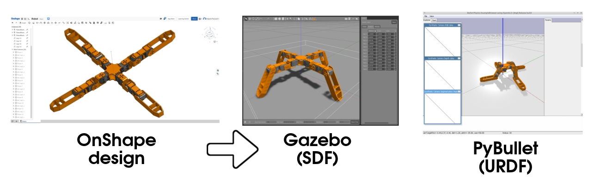

Onshape URDF Exporter Documentation
===================================

Introduction
~~~~~~~~~~~~

Onshape URDF Exporter is a tool that that exports Onshape robot designs as
URDF files. These files can be used with tools like RViz or Gazebo to
calculate inverse kinematics, run physics simulations, and provide
visualizations.

This project is based on onshape-to-robot_, but with some
different design decisions and a number of bug fixes:

- This tool focuses on doing one thing well: Exporting URDFs
- XML document creation is done using Python's XML library, fixing a number of
  bugs related to characters not being properly escaped
- Files created by this tool always have valid filenames, even on Windows
- Uses Open3D for STL simplification instead of MeshLab, which makes
  installation easier
- Uses YAML files for configuration, instead of the non-standard commentjson
  format

.. _onshape-to-robot: https://github.com/Rhoban/onshape-to-robot

* `Onshape URDF Exporter GitHub repository <https://github.com/UrbanMachine/onshape-urdf-exporter>`_
* `Onshape URDF Exporter on PyPI <https://pypi.org/project/onshape-urdf-exporter/>`_

.. toctree::
   :maxdepth: 2
   :caption: Contents:

   installation
   design
   kinematic_loops
   config
